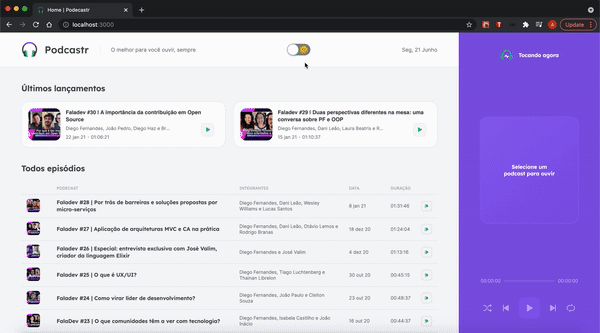

<h1 align="center">
    
</h1>

<p align="center">
  
   
</p>
<p align="center">
  <a href="#art-layout">Layout</a>&nbsp;&nbsp;&nbsp;|&nbsp;&nbsp;&nbsp;
  <a href="#bookmark-sobre">Sobre</a>&nbsp;&nbsp;&nbsp;|&nbsp;&nbsp;&nbsp;
  <a href="#rocket-tecnologias">Tecnologias</a>&nbsp;&nbsp;&nbsp;|&nbsp;&nbsp;&nbsp;
  <a href="#%EF%B8%8F-configuração">Configuração do projeto</a>&nbsp;&nbsp;&nbsp;|&nbsp;&nbsp;&nbsp;
  <a href="#pushpin-to-do">To-do</a>&nbsp;&nbsp;&nbsp;|&nbsp;&nbsp;&nbsp;
  <a href="#memo-licença">Licença</a>
</p>

<p align="center">
  
<p>

## :art: Layout
O layout do projeto foi desenhado no [Figma](https://www.figma.com/) e pode ser visto [clicando aqui](https://www.figma.com/file/syBWFc1KmD8brWum3Taqa9/Podcastr-(Copy)).

## :bookmark: Sobre

O **Podcastr** é uma aplicação de podcasts feita em Next.js. A aplicação reune diversos podcasts publicados pela Rocketseat, que foram hospedados e são consumidos pela aplicação através do Google Cloud.
  
Este projeto foi idealizado e desenvolvido pela [Rocketseat](https://rocketseat.com.br/).

## :rocket: Tecnologias

- [NextJS](https://github.com/vercel/next.js/)
- [TypeScript](https://www.typescriptlang.org/)
- [React](https://reactjs.org/)
- [SASS](https://sass-lang.com/)
- [Date-fns](https://date-fns.org/)
- [Json-server](https://github.com/typicode/json-server)
- [Axios](https://github.com/axios/axios)
- [Rc-slider](https://www.npmjs.com/package/rc-slider)

## ⚙️ Configuração

- ### **Pré-requisitos**

  - É **necessário** possuir o **[Node.js](https://nodejs.org/en/)** instalado no computador
  - É **necessário** possuir uma conta cadastrada no Github
  - É **necessário** possuir o **[Git](https://git-scm.com/)** instalado e configurado no computador
  - É **necessário** ter o gerenciador de pacotes **[Yarn](https://yarnpkg.com/)** instalado ou o **[NPM](https://www.npmjs.com/)**.

- ### Executando o frontend

  ```bash
  # Abra um terminal e copie este repositório com o comando
  $ git clone https://github.com/alexandrecorazza/podcastr.git
  # ou use a opção de download.

  # Entre na pasta server 
  $ cd podcastr-next/

  # Instale as dependências
  $ yarn install

  # Rode o servidor
  $ yarn dev
  ```

- ### Executando a nossa API fake
  ```
  # Abra um novo terminal em uma nova aba
  $ yarn server
  ```
 
- ### Executando com yarn build
  ```
  # Executar com yarn build permite simular o app em produção. Com isso é possível testarmos os recursos do Next como SSR e SSG
  $ yarn build
  
  # Depois execute yarn start
  $ yarn start
  ```

<br>

## :pushpin: To-Do

- [ ] Dark theme
- [ ] Aplicação responsiva

## :memo: Licença

Esse projeto está sob a licença MIT. Veja o arquivo [LICENSE](LICENSE.md) para mais detalhes.
